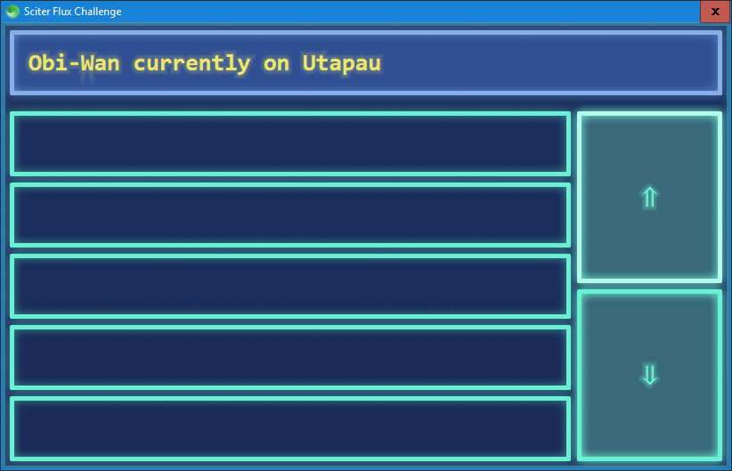

# Sciter Flux Challenge

The [Flux Challenge](https://github.com/staltz/flux-challenge) in Sciter.

:construction: Work in progress. 

## Usage

Run the server from the repository linked above, then run `scapp.exe` inside this folder.

## Preview

